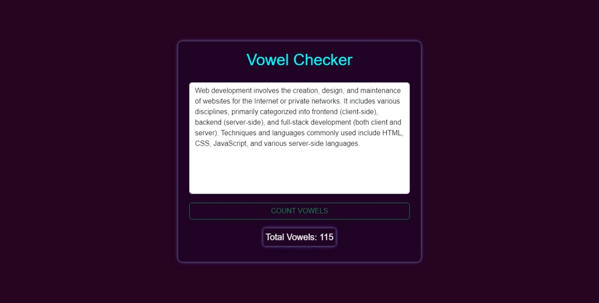

# Vowel Checker

A sleek, neon-themed web application designed to count the number of vowels in a given text. Built with HTML, CSS, and JavaScript, this tool demonstrates modern web development techniques and thoughtful UI design.



---

## Description

The **Vowel Checker** is a simple and efficient application that highlights several interesting techniques and design choices:

1. **Dynamic Vowel Counting**: Uses JavaScript string manipulation to analyze the input and count vowels dynamically.
2. **Neon-Themed Styling**: Employs advanced CSS for shadows and gradients to create a visually engaging neon theme.
3. **Responsive Design**: CSS media queries ensure the app performs well across various screen sizes.
4. **Minimalist and Accessible UI**: Clean, intuitive, and keyboard-friendly interface, suitable for users with accessibility needs.

---

## Interesting Techniques

### JavaScript Techniques
- **Regular Expressions**: The vowel-counting logic uses JavaScript regular expressions (`RegExp`) to identify vowels efficiently. [MDN Reference: RegExp](https://developer.mozilla.org/en-US/docs/Web/JavaScript/Reference/Global_Objects/RegExp)
- **Event Listeners**: JavaScript handles user input via `addEventListener` for form submission and button clicks. [MDN Reference: addEventListener](https://developer.mozilla.org/en-US/docs/Web/API/EventTarget/addEventListener)
- **DOM Manipulation**: Updates the UI dynamically using `document.querySelector` and `innerHTML`. [MDN Reference: Document.querySelector](https://developer.mozilla.org/en-US/docs/Web/API/Document/querySelector)

### CSS Techniques
- **Neon Glow Effect**: Implements CSS `box-shadow` for glowing effects, creating a futuristic neon style. [MDN Reference: box-shadow](https://developer.mozilla.org/en-US/docs/Web/CSS/box-shadow)
- **Custom Fonts**: Uses Google Fonts to include a clean and modern typeface.
- **Dark Mode Design**: Utilizes `background-color` and `color` for improved contrast and readability.

---

## Non-Obvious Technologies and Libraries
1. **Google Fonts**: 
   - Font Used: [Montserrat](https://fonts.google.com/specimen/Montserrat)
   - Link: `<link href="https://fonts.googleapis.com/css2?family=Montserrat:wght@400;700&display=swap" rel="stylesheet">`
2. **CSS Variables**: Custom properties for theming and color consistency across the application. [MDN Reference: CSS Variables](https://developer.mozilla.org/en-US/docs/Web/CSS/Using_CSS_custom_properties)

---

## Project Structure

```plaintext
/
├── index.html        # Main HTML file for the application
├── style.css         # CSS file for styling the application
├── script.js         # JavaScript file for logic and interactivity
├── assets/           # Directory for images, icons, or other static files
└── fonts/            # Directory for any downloaded font files (if applicable)
```

### Notable Directories
- **assets/**: Contains any project-specific images or icons used in the UI.
- **fonts/**: Stores downloaded fonts if you choose not to rely on a CDN (e.g., Google Fonts).

---

## External Libraries and Fonts
- **Google Fonts**: The app uses the [Montserrat](https://fonts.google.com/specimen/Montserrat) font for a clean, modern look. You can include it in the `<head>` of your HTML as follows:
  ```html
  <link href="https://fonts.googleapis.com/css2?family=Montserrat:wght@400;700&display=swap" rel="stylesheet">
  ```
- **FontAwesome (Optional)**: Enhance your app with icons for buttons or additional UI elements. [FontAwesome](https://fontawesome.com/)

---

## Features
1. **Vowel Counting**: Dynamically calculates the number of vowels in real-time.
2. **Neon UI Design**: Dark mode with vibrant neon colors for a modern and eye-catching interface.
3. **Responsive Layout**: Ensures compatibility across devices, from mobile phones to large desktops.
4. **Accessible Interaction**: Keyboard-friendly and accessible design for all users.

---

Feel free to explore the code, suggest improvements, or contribute to its development!